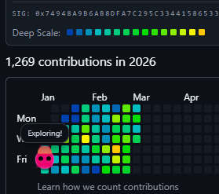
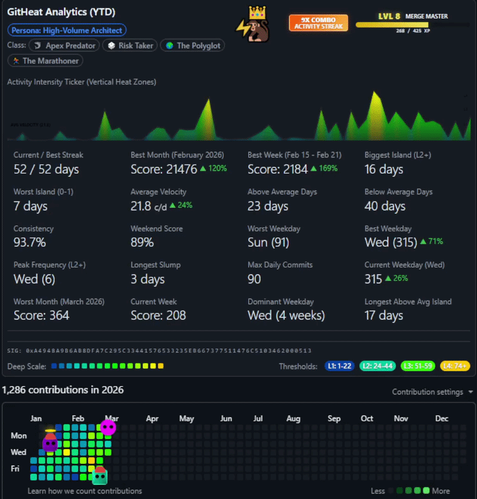

# GitHub DNA Pet 🧬🐾

A Chrome extension that brings your GitHub contribution graph to life with procedurally generated, deterministic digital pets.





## 🌟 The Concept

Your GitHub commit history is your pet's DNA. This extension reads a hex signature from your profile (provided by `gh-pulse-signature`) and uses it as a seed for a procedural generation engine. 

- **Deterministic:** The same signature always produces the exact same pet. 
- **Evolutionary:** As your signature grows with new commits, your pet can mutate and evolve.
- **Interactive:** Your pet patrols your "contribution squares" and reacts to the data beneath its feet.

## 🚀 Features

### 🧠 Procedural Engine & "Paper Doll" System
- **Seeded PRNG:** Powered by `mulberry32` for consistent results across reloads.
- **Integrated Visuals:** Custom CSS `clip-path` shapes for horns, beanies, and mutations that feel like part of the pet.
- **Accessories:** Procedural hats, scarves, and glasses based on specific commit patterns.
- **Face System:** Blinking eyes and blushing cheeks add a layer of "life" to the procedural shapes.

### 😊 Dynamic Moods & Personality
The pet's emotional state changes based on the commit level of the square it currently occupies:
- **😱 Scared:** land on a commitless day (Level 0) and the pet will shiver with tiny eyes.
- **😊 Happy:** land on a day with commits and the pet bobs and chirps.
- **🤩 Ecstatic:** land on a "Big Day" (Level 3+) and the pet glows, bobs rapidly, and displays wide eyes!
- **💬 Speech Bubbles:** Randomized phrases like "*happy chirps*", "Exploring!", or "Where are the commits?" appear dynamically.

### 🗺️ Smart Pathfinding
- **Proximity Patrol:** The pet stays close to the action, restricting its movement to a range between the start of the year and 4 days after today.
- **Weighted Movement:** Higher commit squares are "shinier" and more likely to attract the pet's attention.
- **Multi-Year Support:** Seamlessly transitions and re-spawns when you switch contribution years.

## 🛠️ Technical Stack

- **Language:** TypeScript
- **Bundler:** esbuild
- **Testing:** Jest + ts-jest
- **Platform:** Chrome Extension Manifest V3

## 📦 Installation & Setup

### Development

1. **Clone the repo:**
   ```bash
   git clone https://github.com/yourusername/github-dna-pet.git
   cd github-dna-pet
   ```

2. **Install dependencies:**
   ```bash
   npm install
   ```

3. **Build the project:**
   ```bash
   npm run build
   ```
   This generates a self-contained extension in the `dist/` folder.

4. **Load into Chrome:**
   - Open `chrome://extensions/`
   - Enable "Developer mode" (top right).
   - Click "Load unpacked".
   - Select the `dist/` folder in this repository.

### Testing

Run the procedural engine unit tests:
```bash
npm test
```

## 📜 License

ISC
